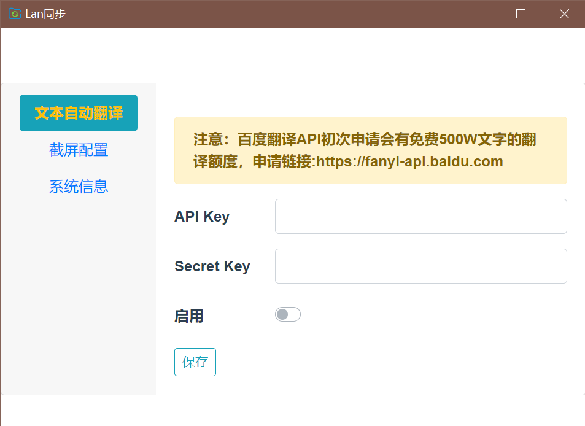

## any-sync-gui

### 跨平台局域网同步工具

一款支持在pc与pc或移动设备之间同步文本信息或文件的应用

### 使用方法

* 前往[release](https://github.com/easyhutu/any-sync-gui/releases)或 *链接：https://pan.baidu.com/s/18uiIlep-jHnZjc5iwvNqSg?pwd=bt73* 下载, 打开应用后，服务默认监听8081端口
* 手机扫描二维码打开链接或直接访问http://${ip}:8081打开网页
* 选择在线的设备，即可显示出同步文本框和文件上传按钮，输入文件或上传文件后同步显示在目标设备上

*同步文本内嵌百度翻译api，可提供实时翻译*

不需要UI界面可移步 [https://github.com/easyhutu/any-sync](https://github.com/easyhutu/any-sync) 下载go二进制文件



### DEV
核心依赖： 
* nodejs v16.19.0
* Vue
* Electron

> fe

gui依赖fe打包的前端页面，需要先打包fe才可以调试electron

```shell
cd fe

npm install

# 调试
nmp run serve

# 打包
npm run build
```

> electron_gui桌面应用及伴生服务初始化

```shell
cd electron_gui

npm install

# 调试
npm run start

# 打包应用
npm run make
```